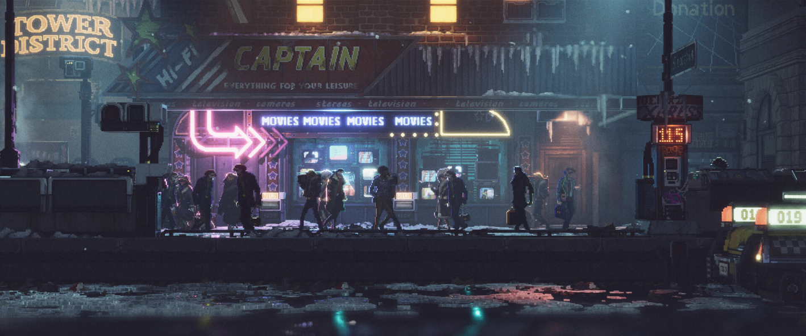

<!--título-->

  <ul align="center">
    
<h1 style="display: inline-block">Hello World</h1>

  

  <ul align="center">
    
<h1 style="display: inline-block">Sobre Mim</h1>

   Olá, meu nome é Douglas e atualmente estudo na área de desenvolvimento de sistemas web no Senai. Estou comprometido com a busca por conhecimento e oportunidades intelectuais, acreditando no potencial da tecnologia para resolver problemas reais. Busco constantemente desafios
   para expandir meus horizontes e buscando sempre a melhor maneira de transformar ideias em soluções práticas e inovadoras.

  Tenho 22 anos e atualmente vivo no Espírito Santo, Brasil. Embora eu não seja fluente em inglês, tenho a intenção de me aprofundar no assunto. Já tenho algumas praticas com JavaScript, HTML, CSS e C#, mas ainda estou aprendendo como e o funcionamentos dessas tecnologias. Pretendo começar a compartilhar conteúdos sobre alguns projetos relacionado ao desenvolvimento web no LinkedIn. Acredito que isso me ajudará a desenvolver outras habilidades importantes, como comunicação, criatividade e criação de conteúdos mais avançados.

 

  
🖥️ Quando não estou programando

  

   

  Eu gosto de ler e jogar, normalmente coisas de terror/ação/ficção, também assisto filmes/séries/animes de diversos gêneros, e as vezes pratico alguns esportes que são caminhada/corridas, basquete e skate.  Acredito que nossos interesses pessoais podem, de alguma forma, nos ajudar a desenvolver e solucionar projetos e problemas com mais facilidade.

 

## GitHub Stats

 

<!-- Portfolio -->
## Projetos

- [MEU 1° PROJETO: Biblioteca Virtual](https://github.com/F0RT-DEV/bibliotecaDigital)

 

## Habilidades

 

## Socials

